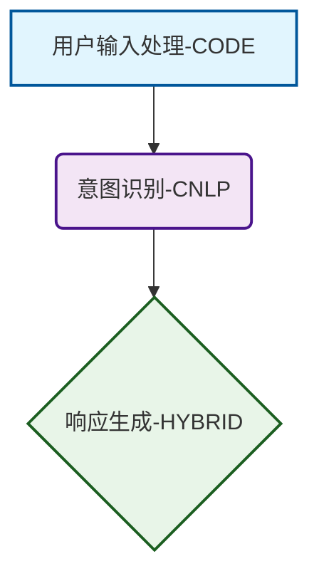

# Mermaid流程图生成功能说明

## 概述

本系统新增了基于子系统和协作关系自动生成Mermaid流程图的功能，可以将复杂的系统架构以可视化的方式呈现。

## 功能特点

### 🎯 核心功能
- **自动流程图生成**: 根据子系统列表和协作关系描述，自动生成Mermaid流程图
- **并行处理**: 在代码生成过程中并行生成流程图，提高效率
- **类型区分**: 根据子系统实现方式（代码/CNLP/混合）进行视觉区分
- **语法验证**: 自动验证生成的Mermaid代码语法正确性

### 🎨 视觉效果
- **矩形节点** `[]`: 代码实现的子系统（蓝色主题）
- **圆角矩形节点** `()`: CNLP实现的子系统（紫色主题）
- **菱形节点** `{}`: 混合实现的子系统（绿色主题）

## 使用方法

### 1. 独立使用MermaidGenerator

```python
from mermaid_generator import MermaidGenerator

# 准备数据
data = {
    "subsystems": [
        {
            "name": "输入处理子系统",
            "code": "def process_input(): pass"  # 代码实现
        },
        {
            "name": "数据分析子系统", 
            "cnlp": "使用自然语言处理..."  # CNLP实现
        }
    ],
    "collaboration": "输入处理子系统接收数据，传递给数据分析子系统..."
}

# 生成流程图
generator = MermaidGenerator()
mermaid_code = generator.generate_mermaid_diagram(data)
```

### 2. 集成在代码生成流程中

```python
from code_generator import CodeGenerator

# 在批量处理时自动生成
code_gen = CodeGenerator()
result = code_gen.batch_process_subsystems(
    subsystems_data, 
    generate_mermaid=True  # 启用mermaid生成
)

# 获取生成的流程图
if "mermaid_diagram" in result:
    mermaid_code = result["mermaid_diagram"]
```

### 3. 保存到文件

```python
# 保存为Markdown文件
generator.save_mermaid_to_file(mermaid_code, "system_flowchart")
# 生成: gen_code/output/system_flowchart.md
```

## 数据格式要求

### 输入数据结构

```json
{
    "subsystems": [
        {
            "name": "子系统名称",
            "description": "子系统描述（可选）",
            "code": "Python代码（可选）",
            "cnlp": "CNLP描述（可选）"
        }
    ],
    "collaboration": "子系统间协作关系的详细描述"
}
```

### 子系统实现方式判断

| 字段组合 | 实现方式 | 节点类型 | 样式 |
|---------|---------|----------|------|
| 仅有`code` | CODE | `[名称-CODE]` | 蓝色矩形 |
| 仅有`cnlp` | CNLP | `(名称-CNLP)` | 紫色圆角矩形 |
| 同时有`code`和`cnlp` | HYBRID | `{名称-HYBRID}` | 绿色菱形 |

## 生成示例

### 输入数据
```json
{
    "subsystems": [
        {
            "name": "用户输入处理",
            "code": "def process_user_input(text): return text.strip()"
        },
        {
            "name": "意图识别",
            "cnlp": "使用NLP模型识别用户意图和实体"
        },
        {
            "name": "响应生成",
            "code": "def generate_response(intent): return format_response(intent)",
            "cnlp": "基于意图生成自然语言响应"
        }
    ],
    "collaboration": "用户输入处理模块首先清理用户输入，然后传递给意图识别模块进行语义分析，最后由响应生成模块产生回复。"
}
```

### 生成的Mermaid代码


## API参考

### MermaidGenerator类

#### 主要方法

```python
def generate_mermaid_diagram(self, subsystems_data: Dict[str, Any], quiet: bool = False) -> Optional[str]
```
- **功能**: 生成基础Mermaid流程图
- **参数**: 
  - `subsystems_data`: 包含subsystems和collaboration的数据
  - `quiet`: 是否使用安静模式（不输出日志）
- **返回**: Mermaid代码字符串或None

```python
def validate_mermaid_syntax(self, mermaid_code: str) -> Tuple[bool, str]
```
- **功能**: 验证Mermaid代码语法
- **返回**: (是否有效, 错误信息)

```python
def save_mermaid_to_file(self, mermaid_code: str, filename: str, output_dir: str = "gen_code/output") -> bool
```
- **功能**: 保存Mermaid代码为Markdown文件
- **返回**: 是否保存成功

### CodeGenerator集成

#### 更新的方法

```python
def batch_process_subsystems(self, ..., generate_mermaid: bool = True) -> Dict[str, Any]
```
- **新增参数**: `generate_mermaid` - 是否生成流程图
- **返回结果**: 在原有结果基础上增加 `"mermaid_diagram"` 字段

## 性能优化

### 并行处理
- 在并行模式下，Mermaid生成与子系统代码生成同时进行
- 使用独立线程，不影响主流程性能
- 自动容错，生成失败不影响其他功能

### 错误处理
- 完善的异常捕获和日志记录
- 语法验证确保生成代码可用
- 静默模式支持，适合批量处理

## 文件输出

生成的文件包含：
1. **完整的Mermaid代码**
2. **渲染说明**
3. **图例解释**

示例文件结构：
```
gen_code/output/
├── system_flowchart.md          # 系统流程图
├── code_generation_results.json # 完整处理结果
└── [其他生成的代码文件]
```

## 测试验证

运行测试脚本验证功能：

```bash
python test_mermaid_generation.py
```

测试包括：
- ✅ 基础生成功能
- ✅ 语法验证
- ✅ 文件保存
- ✅ 集成测试
- ✅ 边缘情况处理

## 注意事项

1. **数据完整性**: 确保`collaboration`字段包含足够的关系描述
2. **命名规范**: 子系统名称应简洁明确，避免特殊字符
3. **文件权限**: 确保输出目录有写入权限
4. **LLM调用**: 功能依赖LLM服务，需确保网络连接正常

## 未来扩展

- [ ] 支持更多节点形状和样式
- [ ] 添加输入输出参数显示
- [ ] 支持子图分组
- [ ] 交互式流程图生成
- [ ] 多种图表格式导出 