# PromptSplit - 智能提示词拆分系统

[](https://python.org)
[](LICENSE)

一个智能的提示词拆分和结构化系统，能够自动将复杂的自然语言提示词转换为可复用、模块化的模板系统。

## 🎯 项目概述

PromptSplit 是一个完整的提示词工程自动化工具，旨在解决以下问题：
- 复杂提示词难以维护和复用
- 缺乏标准化的提示词结构
- 无法有效拆分大型提示词系统
- 需要将自然语言提示转换为结构化格式

## ✨ 核心特性

- **🔍 智能变量提取**：自动识别并标记提示词中的动态内容
- **🔀 多维度拆分**：支持功能模块拆分，生成清晰的系统架构
- **📊 可视化分析**：自动生成 Mermaid 流程图，直观展示系统结构
- **🏗️ 结构化输出**：转换为 CNLP (Controlled Natural Language Programming) 格式
- **⚡ 并发处理**：支持多线程并发，提高处理效率
- **💾 中间结果保存**：每个步骤都会保存中间结果，支持断点续传

## 🔄 工作流程

```mermaid
graph LR
    A[原始提示词] --> B[提取变量]
    B --> C[生成Mermaid图]
    C --> D[拆分子系统]
    D --> E[生成子提示词]
    E --> F[转换CNLP格式]
    F --> G[结构化输出]
```



### 详细步骤

1. **第一步：智能变量提取**
   - 文本分块处理，支持大文本
   - 并发提取显式和隐式变量
   - 自动去重和后处理优化

2. **第二步：系统拆分**
   - 生成 Mermaid 流程图分析
   - 拆分为独立的子系统模块
   - 为每个子系统生成专门的提示词

3. **第三步：格式转换**
   - 转换为标准化的 CNLP 格式
   - 生成可执行的 Agent 定义
   - 包含角色、约束、工作流程等

## 🚀 快速开始

### 环境要求

- Python 3.8+
- 支持的操作系统：Windows, macOS, Linux

### 安装依赖

```bash
pip install json re concurrent.futures typing
```

### 基本使用

1. **准备输入文件**
   ```bash
   # 将您的原始提示词保存为 nl_prompt.txt
   echo "您的提示词内容" > nl_prompt.txt
   ```

2. **运行拆分系统**
   ```bash
   python run_split.py
   ```

3. **查看结果**
   ```bash
   # 检查生成的输出文件
   ls output_*.json output_*.txt
   ```

## 📁 项目结构

```
PromptSplit/
├── run_split.py                    # 🎯 主要的流程编排器
├── extract_variable.py             # 🔍 变量提取模块
├── first_spilit.py                 # 🎨 Mermaid生成和拆分模块
├── nl2cnlp.py                      # 🔄 CNLP转换模块
├── LLMTool.py                      # 🤖 LLM API客户端
├── extract_var_v6.txt              # 📝 变量提取提示模板
├── post_process_variable_v2.txt    # ✨ 变量后处理提示
├── nl_prompt.txt                   # 📥 输入：原始提示词
├── sub_prompts.json                # 📋 子提示词示例格式
└── README.md                       # 📖 使用说明
```

## 📊 输出文件说明

运行完成后，系统会生成以下文件：

| 文件名 | 描述 | 内容示例 |
|--------|------|----------|
| `output_step1_variables.json` | 变量提取结果 | 变量列表、统计信息 |
| `output_step1_text_with_vars.txt` | 标记变量的文本 | 原文本 + `{变量}` 标记 |
| `output_step2_split.json` | 完整拆分结果 | 子系统、子提示词、统计 |
| `output_step2_mermaid.txt` | Mermaid流程图 | 可渲染的流程图代码 |
| `output_step3_cnlp.json` | CNLP转换结果 | 结构化Agent定义 |
| `output_final_result.json` | 完整流程结果 | 所有步骤的汇总结果 |

### 输出示例

**变量提取结果 (`output_step1_variables.json`)**
```json
{
  "variables": [
    "客户情绪", 
    "产品信息", 
    "需求条件",
    "话题"
  ],
  "text_with_vars": "处理{客户情绪}相关的{产品信息}需求...",
  "chunks_count": 3
}
```

**拆分结果 (`output_step2_split.json`)**
```json
{
  "method": "functional_split",
  "mermaid_content": "flowchart TD\n  A[输入处理] --> B[需求分析]\n  B --> C[响应生成]",
  "subsystems": {
    "subsystems": [
      {
        "name": "输入处理模块",
        "responsibility": "处理用户输入和数据预处理",
        "independence": "独立的数据处理层"
      }
    ]
  },
  "subprompts": {
    "subprompts": [
      {
        "name": "输入处理器",
        "prompt": "你是一个专业的输入处理器...",
        "inputs": ["{用户输入}", "{历史记录}"],
        "outputs": ["{处理结果}", "{状态信息}"]
      }
    ]
  },
  "statistics": {
    "subsystems_count": 3,
    "subprompts_count": 3
  }
}
```

**CNLP格式 (`output_step3_cnlp.json`)**
```json
{
  "cnlp_results": [
    {
      "index": 0,
      "name": "输入处理器",
      "cnlp": "[DEFINE_AGENT: InputProcessor \"输入处理专家\"]\n    [DEFINE_PERSONA:]\n        ROLE: 专业的输入数据处理和验证专家\n    [END_PERSONA]\n    [DEFINE_WORKER: \"处理用户输入\" ProcessInput]\n        [INPUTS]\n            REQUIRED <REF> 用户输入 </REF>\n        [END_INPUTS]\n        [OUTPUTS]\n            REQUIRED <REF> 处理结果 </REF>\n        [END_OUTPUTS]\n        [MAIN_FLOW]\n            [SEQUENTIAL_BLOCK]\n                COMMAND-1 [COMMAND 验证输入格式...]\n            [END_SEQUENTIAL_BLOCK]\n        [END_MAIN_FLOW]\n    [END_WORKER]\n[END_AGENT]"
    }
  ],
  "success_count": 3,
  "failed_count": 0
}
```

## ⚙️ 配置和自定义

### LLM配置

在 `LLMTool.py` 中配置您的LLM API：

```python
# API配置示例
DEFAULT_API_URL = "https://api.your-llm-provider.com/v1/chat/completions"
DEFAULT_MODEL = "your-model-name"
API_KEY = "your-api-key"
```

### 自定义参数

您可以通过编程方式自定义运行参数：

```python
from run_split import PromptSplitPipeline

# 创建流程编排器
pipeline = PromptSplitPipeline()

# 自定义运行
result = pipeline.run_complete_pipeline(
    input_file='custom_prompt.txt',    # 自定义输入文件
    save_intermediate=True             # 是否保存中间结果
)

# 单独运行某个步骤
step1_result = pipeline.step1_extract_variables(text)
step2_result = pipeline.step2_split_to_subprompts(text_with_vars)
step3_result = pipeline.step3_convert_to_cnlp(split_result)
```

## 🔧 高级用法

### 批量处理

```python
import os
from run_split import PromptSplitPipeline

pipeline = PromptSplitPipeline()

# 批量处理多个文件
prompt_files = ['prompt1.txt', 'prompt2.txt', 'prompt3.txt']

for i, file in enumerate(prompt_files):
    print(f"处理文件 {i+1}/{len(prompt_files)}: {file}")
    result = pipeline.run_complete_pipeline(
        input_file=file,
        save_intermediate=True
    )
    # 重命名输出文件避免覆盖
    if "error" not in result:
        os.rename('output_final_result.json', f'output_final_result_{i+1}.json')
```

### 集成到您的项目

```python
from run_split import PromptSplitPipeline

class YourPromptManager:
    def __init__(self):
        self.splitter = PromptSplitPipeline()
    
    def process_prompt(self, prompt_text: str) -> dict:
        # 临时保存提示词
        with open('temp_prompt.txt', 'w', encoding='utf-8') as f:
            f.write(prompt_text)
        
        # 处理
        result = self.splitter.run_complete_pipeline(
            input_file='temp_prompt.txt',
            save_intermediate=False
        )
        
        # 清理临时文件
        os.remove('temp_prompt.txt')
        
        return result
```

## 📈 性能优化

### 调整并发参数

在 `extract_variable.py` 中的 `process_chunks_concurrently` 函数：

```python
# 增加并发线程数（根据您的硬件配置）
results = process_chunks_concurrently(chunks, max_workers=10)
```

### 调整文本分块大小

在变量提取时：

```python
# 根据您的文本特点调整分块大小
chunks = split_text_by_length(text, chunk_size=300)  # 默认500
```

## 🐛 故障排除

### 常见问题

**Q: 提示"文件不存在"**
```bash
❌ 文件 nl_prompt.txt 不存在
```
**A**: 确保在项目根目录下创建了 `nl_prompt.txt` 文件，并包含您要处理的提示词内容。

**Q: API调用失败**
```bash
❌ 调用API时发生错误: Connection timeout
```
**A**: 检查以下几点：
- 网络连接是否正常
- `LLMTool.py` 中的API配置是否正确
- API密钥是否有效
- API服务是否可用

**Q: 变量提取结果为空**
```bash
🎯 提取到 0 个变量: []
```
**A**: 可能的原因：
- 输入文本过短或不包含可提取的变量
- `extract_var_v6.txt` 提示模板需要优化
- LLM模型理解能力限制

**Q: Mermaid图生成失败**
```bash
⚠️ 未找到mermaid图，返回完整响应
```
**A**: 这通常是LLM输出格式问题：
- 检查 `first_spilit.py` 中的提示模板
- 尝试不同的LLM模型
- 检查输入文本的复杂度

**Q: 子系统拆分失败**
```bash
❌ 子系统拆分失败: No valid JSON found
```
**A**: JSON解析错误：
- LLM输出格式不符合预期
- 可以检查中间输出文件排查问题
- 尝试简化输入文本

### 调试模式

添加更详细的日志输出：

```python
import logging

# 配置日志
logging.basicConfig(level=logging.DEBUG)

# 在主函数中添加
if __name__ == '__main__':
    try:
        success = main()
        exit(0 if success else 1)
    except Exception as e:
        logging.error(f"系统异常: {e}", exc_info=True)
        exit(1)
```

## 📋 最佳实践

### 1. 输入文本准备
- **清晰结构**: 确保原始提示词有清晰的段落和逻辑结构
- **适当长度**: 建议单个提示词长度在1000-5000字符之间
- **避免格式问题**: 使用UTF-8编码，避免特殊字符

### 2. 变量命名
- 使用有意义的变量名
- 避免过于通用的词汇（如"内容"、"信息"）
- 保持一致的命名风格

### 3. 结果验证
- 检查每个步骤的输出质量
- 验证生成的子提示词是否保持原文语义
- 确认CNLP格式的正确性

### 4. 性能优化
- 对于大文本，适当调整分块大小
- 根据硬件配置调整并发线程数
- 定期清理临时文件

## 🤝 贡献指南

欢迎提交Issue和Pull Request！

### 开发环境设置

```bash
# 克隆项目
git clone https://github.com/your-username/PromptSplit.git
cd PromptSplit

# 安装开发依赖
pip install -r requirements-dev.txt

# 运行测试
python -m pytest tests/
```

### 提交规范

- 遵循 [Conventional Commits](https://conventionalcommits.org/) 规范
- 确保代码通过所有测试
- 添加必要的文档说明

## 📄 许可证

本项目基于 MIT 许可证开源 - 查看 [LICENSE](LICENSE) 文件了解详情。

## 🙏 致谢

- 感谢所有贡献者的支持
- 基于先进的大语言模型技术
- 参考了多个开源项目的设计理念

## 📞 联系方式

- 项目主页: [GitHub Repository](https://github.com/your-username/PromptSplit)
- 问题反馈: [Issues](https://github.com/your-username/PromptSplit/issues)
- 讨论交流: [Discussions](https://github.com/your-username/PromptSplit/discussions)

---

**快速开始示例**

```bash
# 1. 准备您的提示词
echo "您的复杂提示词内容..." > nl_prompt.txt

# 2. 运行拆分系统
python run_split.py

# 3. 查看结果
cat output_final_result.json | python -m json.tool
```

🎉 **祝您使用愉快！如有问题请随时反馈。** 